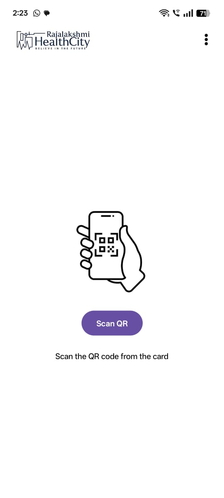
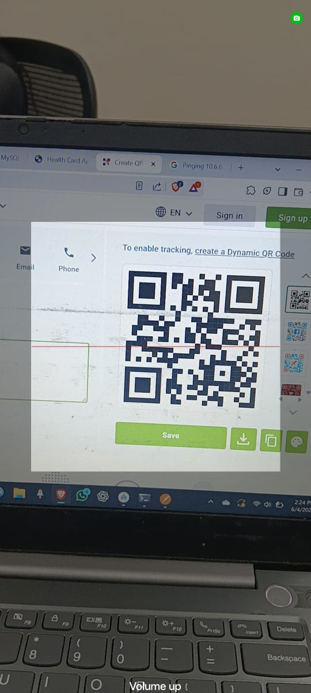
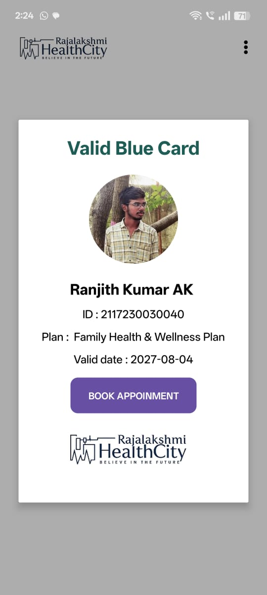
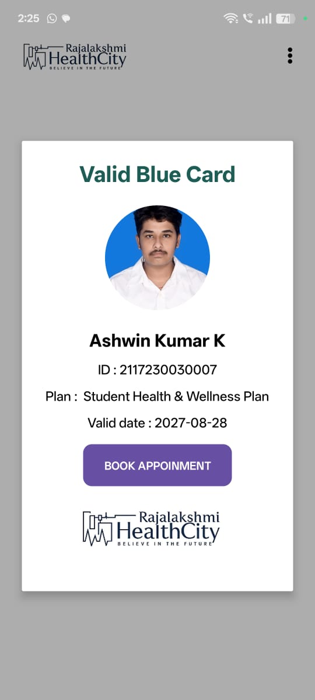

# 🏥 HealthCare QR System (Android App)

A modern Android application designed for healthcare organizations to **scan QR codes from health cards**, **fetch patient information securely**, and **display it with profile images**. This system ensures fast access to patient data using **QR scanning**, **Node.js API**, and **MySQL/PostgreSQL** databases — with image hosting handled through **Cloudinary**.

---

## 🚀 Features

* 🔍 **QR Code Scanning** using `zxing-android-embedded`
* 🌐 **Volley-based API Integration** to fetch user data from Node.js backend
* 🧲 **MySQL / PostgreSQL** as the user data store
* ☁️ **Cloudinary** used for secure and fast image hosting
* 🔐 Secure scanning of patient card QR codes to access essential information
* 📷 Displays image and patient details fetched from backend
* ✅ Efficient, responsive, and easy to use for healthcare professionals

---

## 📱 Screenshots







---

## 🛠️ Tech Stack

| Component     | Technology             |
| ------------- | ---------------------- |
| Android App   | Java, XML              |
| QR Scanning   | ZXing Embedded Library |
| Networking    | Volley                 |
| Backend API   | Node.js (Express)      |
| Database      | MySQL / PostgreSQL     |
| Image Hosting | Cloudinary             |

---

## 🛆 Project Structure

```
📂 app
 ├📂 java/com/example/healthcaresystem
 ┃ ├📄 MainActivity.java        # Launches camera and handles QR scans
 ┃ ├📄 Capture.java             # Custom class for QR scanner (extends CaptureActivity)
 ┃ └📄 utils/ApiClient.java     # Volley or Retrofit-based API client (if added)
 ├📂 res/layout
 ┃ └📄 activity_main.xml        # Layout for UI (TextView, ImageView, Button)
 └📜 AndroidManifest.xml
```

---

## ⚖️ How It Works

1. **QR Code Scanning**

   * User taps **Scan** button
   * Camera opens and scans the QR code on the patient's card
   * QR contains a unique user ID

2. **Fetching Patient Data**

   * The app sends a **GET** request to:

     ```
     https://your-backend-api.com/api/user/{id}
     ```
   * The Node.js backend queries the database and returns:

     ```json
     {
       "name": "Ranjith kumar",
       "plan": "Student-premium",
       "gender": "Male",
       "image_url": "https://res.cloudinary.com/..."
     }
     ```

3. **Displaying Results**

   * Volley parses the JSON
   * Updates the UI with:

     * Name
     * Age
     * Image loaded using Glide/Picasso

---

## 🧰 Dependencies

Add these in your `build.gradle`:

```gradle
implementation 'com.journeyapps:zxing-android-embedded:4.3.0'
implementation 'com.android.volley:volley:1.2.1'
implementation 'com.squareup.picasso:picasso:2.8' // or Glide
```

---

## 📡 API Sample (Node.js Backend)

```js
app.get('/api/user/:id', async (req, res) => {
  const id = req.params.id;
  const user = await db.query('SELECT * FROM users WHERE id = ?', [id]);
  res.json(user[0]);
});
```

---

## 🖼️ Example QR Code Format

* QR contains just the **user ID**
* Example: `1045`

---

## ⚙️ Configuration

### 1. Set API URL

In your `MainActivity.java`:

```java
String apiUrl = "https://your-api-url.com/api/user/";
```

### 2. Cloudinary

* Use Cloudinary Admin Dashboard to get your image URLs
* Upload images and store URLs in DB

---

## 🧠 Setup Instructions

1. Clone this repository
2. Open in Android Studio
3. Add internet permission in `AndroidManifest.xml`:

   ```xml
   <uses-permission android:name="android.permission.INTERNET" />
   ```
4. Add your backend API URL
5. Run the app on a real device

---

## ✅ Future Improvements

* Add Authentication (Doctor login)
* Offline QR data caching
* Scan history
* FHIR or HL7 standards integration

---

## 🧑‍💻 Developers

* 👨‍💻 Ranjith Kumar A.K
* 🧠 Ashwin kumar K

---

## 📄 License

This project is for educational and institutional healthcare use.

---

## 🛍️ Feedback

Feel free to open an issue or contact [akranjithkumar03@gmail.com](akranjithkumar03@gmail.com) for suggestions or bug reports.
